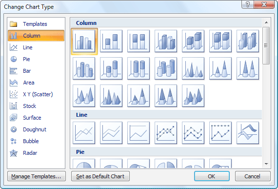
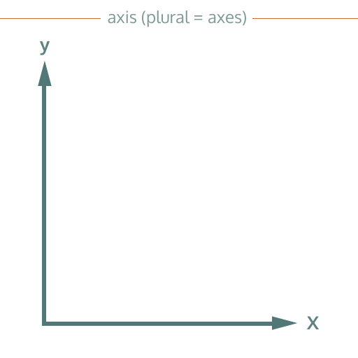
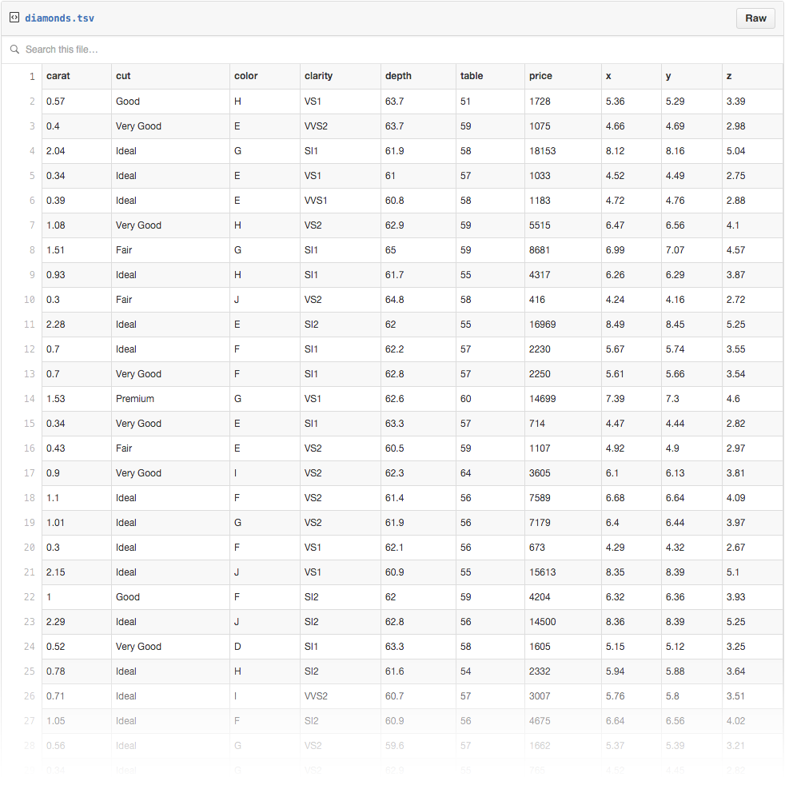

# Flexible Visualization

## What is a visualization Builder?
> Visual representations of abstract data to **amplify cognition**.

1. General process of visualizing data
    1. Understanding Task
    1. Prepare Dataset
        * understanding dataset
        * data cleansing
        * aggregation, calculation
        * rank, filter
    1. Decide Representation
    1. **Create Visualization**
        * visual encodings
        * data binding
        * layout composition

**Analysis vs. Presentation**: explore the data or build visualization

## Why flexibility matters?
> Elegant design requires us to think about a theory of graphics, not charts.

### How to make a bar chart?


1. **Template Editors**: Choose a bar chart and bind data  
    
    * **Products**: Excel, Wyn, ...
    * **Less Expressivity**: inevitably offer fewer charts than people want
    * **More Complexity**: hard to reuse objects that similarly in different charts

2. **Expressive Tools**: Code or paint manually  
    
    * **Products**: D3.js (for developer), Adobe illustrator (for designer), ...
    * **High Skill Required**: long time to learn
    * **Slow & Tedious**: long time to create a visualization

3. **Visual Builders**: Composed by rectangles and two lines  
       
    * **Products**: Lyra, Charticulator, Data Illustrator, ...
    * **More Expressivity**: compare to *Template Editors*
    * **More Learnability**: compare to *Expressive Tools*
    * **More Efficiency**: easy to create a visualization

## Unified Terminology
### Chart
* **Axes**: These are the _lines_ that go up and down (*the vertical Y axis*), or left and right (*the horizontal X axis*)  


### Dataset
* **Vector**: Each _row_ in the table
* **Dimension**: Each _column_ in the table, a named attribute whose values have a particular meaning  
  

### Data Types
* **Categorical**: Represents characteristics. like person's gender, language etc.
    * **Nominal**: Represent _discrete_ units and are used to _label_ variables.(no order) `["Female", "Male"]` 
    * **Ordinal**: Represent _discrete_ and _ordered_ units. `["Elementary", "High School", "College"]`
* **Numerical**
    * **Continuous**: Values _can’t be counted but it can be measured_. like the number of heads in 10 coins.
    * **Discrete**: Values _can’t be measured but it can be counted_. like height of a person.

### Visual
* **Scale**
    * Just like the scale of a map, but more general
    * A function that transforms *data variable* values into *visual property*
    * With two scales (x and y), we have the basis for a scatter plot.
    * Scales can represent visual encoding, such as colors, shapes, or size
    * *Axes* refer to spatial scales and *Legends* refer to non-spatial scales
* **Mark**
    * Marks are the basic visual building block of a visualization
    * Graphical elements such as shapes(rect, line), images and texts
* **Glyph**
    * A group of marks to be repeated by data

## Evaluate Existing Visual Builders
> Chase the expanding horizon of what visualizations are capable of, and learn from other visualization design approaches to produce better products

### Marks + Data Binding + Layout = Visualization
* Marks
    * Rectangle: bar chart, stacked bar chart, ...
    * Line: line
    * Text: label
* Data Binding
    1. Generating glyphs based on data.(*repeat*)
    2. Specify proper scales between data fields and mark properties.
* Layout
  * Relative Layout: locate by drag and drop
  * Coordinate System: cartesian, polar, custom?

### Lyra + Vega
> An interactive, graphical Visualization Design Environment (VDE)

1. About
    1. From UW Interactive Data Lab (*began in 1990s, notable projects includes **Tableau**, **D3.js***)
    1. [Vega](https://vega.github.io/)
    1. [Lyra Builder](http://idl.cs.washington.edu/projects/lyra/app/)

1. Features
    * Data transformations
    * Visible scales, scale inference
    * Uses the Vega grammar as both an internal model and external file format.

1. Vega Grammar - [Let's Make A Bar Chart Tutorial](https://vega.github.io/vega/tutorials/bar-chart/)
    1. **Scales**: Mapping data to visual value. (mathematical function)
        * **Quantitative Scales**: continuous -> continuous. 
        * **Discrete Scales**: discrete -> discrete.
        * **Discretizing Scales**: continuous -> discrete.
    1. **Axes**: Mapping data to Cartesian coordinates.(like scales)
    1. **Transforms**： Data Processor. (filter, sort, rank...)
        * **Aggregate**: sum, group, count, ...
        * **Collect**: sort
        * **Filter**: filter
        * **Window**: running/moving
        * **Regression**: trendline
    1. **Marks**: Encode data using geometric primitives
        * **Area**: area chart
        * **Arc**: pie chart
        * **Line**: line chart
        * **Rect**: bar chart
        * **Rule**: axis ticks, grid lines
        * **Text**: label, title
1. Implementation
    1. **Declarative JSON Specification**
    1. **Reactive Dataflow Graph** *(parser)*
        1. Process Data
        1. Handle Interaction
        1. Construct Graph: bind -> build *(one mark per vector)* -> evaluate *(encode mark)*  
    
    1. **Render**: Tree-structured scenegraph definition -> Graph in canvas
    ```json
    // a simple scenegraph definition
    { 
        "marktype": "rect",
        "items": [
            {"x": 0, "y": 0, "width": 50, "height": 50, "fill": "steelblue"},
            {"x": 100, "y": 50, "width": 50, "height": 50, "fill": "firebrick"},
            {"x": 50, "y": 100, "width": 50, "height": 50, "fill": "forestgreen"}
        ]
    }
    ```

### Charticulator
> Interactive Layout-Aware Construction of Bespoke Charts

1. About
    1. From **Microsoft** Research
    1. Compatible with **Power BI** as a custom visual
    1. Site: [Charticulator](https://charticulator.com/index.html)

1. Features
    * Individual glyph editor
    * One vector per glyph
    * Implicit scale based on data type. (categorical -> group, numerical -> location)

1. Implementation
    * **Data Types**  
      
    **Marks** are primitive graphical elements  
    **Glyph-level** specification includes **glyph elements** and **layout constraints**  
    **Chart-level** specification includes **chart elements**, **layout constraints** between them, and **scales**
    * **Constraint-based Layout**  
    A horizontal scaffold enforces the glyphs to be horizontally adjacent to one another.  
    `equals`  
       
    Converts layouts into mathematical constraints.

### Data Illustrator (DI)
> Create infographics and data visualizations without programming

1. About
    1. From **Adobe** and the Georgia Institute of Technology
    1. Inspiration: [Bret Victor - Drawing Dynamic Visualizations](https://www.youtube.com/watch?v=ef2jpjTEB5U)
    1. Site: [Data Illustrator](http://data-illustrator.com/)

1. Features
    * Direct manipulation
    * Core Operations: repeat and partition


### Compare
Product | Scale Visibility | A Glyph Represent
------- | --- | --- |
Lyra | Visible | One Vector
Charticulator |  Implicit | One Vector
Data Illustrator | Implicit | One / More

* Scale Visibility
    * Visible scales, are lack of learnability, bring more expressivity, and vice versa. (lyra, mapX in charticulator)
    * Implicit scales make new added scale more ambiguous - is it a new scale? or an existing one? (DI)
    * Generate scale function automatically during data binding would be helpful. (all three)
    * Shared scales link individual glyphs together to produce visualization. (y-axis in charticulator, proper label position in DI)
* A Glyph Represent
    * A glyph represent one vector means dataset need to fit builder. ([transform](https://vega.github.io/vega/docs/transforms/) in Lyra, groupBy in Charticulator plotSegment)
    * A dynamic data table panel would be helpful (Lyra, DI)


## Related Resources
1. [Data Types in Statistics](https://towardsdatascience.com/data-types-in-statistics-347e152e8bee)
1. [Introducing d3-scale](https://medium.com/@mbostock/introducing-d3-scale-61980c51545f)
1. [A Guide to Guides: Axes & Legends in Vega](https://observablehq.com/@vega/a-guide-to-guides-axes-legends-in-vega)
1. [Bret Victor - Drawing Dynamic Visualizations](https://www.youtube.com/watch?v=ef2jpjTEB5U)
1. [Third Wave Data Visualization](https://www.youtube.com/watch?v=itChfcTx7ao&feature=youtu.be)
1. [The Grammar Of Graphics](https://epdf.pub/the-grammar-of-graphics-second-edition.html)
1. [Lyra: An Interactive Visualization Design Environment](https://idl.cs.washington.edu/files/2014-Lyra-EuroVis.pdf)
1. [Reactive Vega: A Streaming Dataflow Architecture
for Declarative Interactive Visualization](https://idl.cs.washington.edu/files/2015-ReactiveVega-InfoVis.pdf)
1. [Charticulator: Interactive Construction of Bespoke Chart Layouts](https://www.microsoft.com/en-us/research/uploads/prod/2018/08/Charticulator-InfoVis2018.pdf)
1. [Data Illustrator: Augmenting Vector Design Tools with Lazy Data Binding for Expressive Visualization Authoring](http://data-illustrator.com/papers/DataIllustratorCHI18.pdf)
1. [Critical Reflections on Visualization Authoring Systems-PDF](https://idl.cs.washington.edu/files/2019-ReflectionsVisAuthoring-InfoVis.pdf)
1. [Critical Reflections on Visualization Authoring Systems-Table](https://vis-tools-reflections.github.io/)
1. [La Lettura - VISUAL DATA](https://www.flickr.com/photos/accurat/albums/72157632185046466)